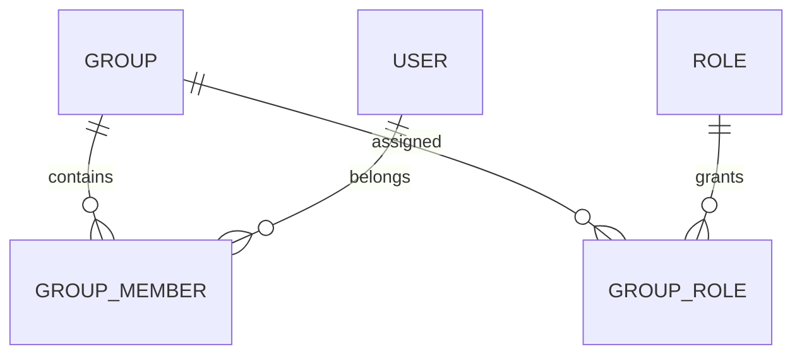

# Groups

---

# Overview

The Group component provides logical collections of users within the Capanna Digital Platform (CDP).

Groups simplify identity administration by allowing permissions, roles, policies, notifications, and application access to be assigned collectively rather than individually.

Groups may represent departments, business units, project teams, manufacturing cells, warehouse operators, AI agents, or any organizational structure.

---

# Objectives

The Groups component provides:

- Centralized group management
- Role assignment by group
- Simplified administration
- Dynamic membership
- Nested groups
- Cross-organization collaboration
- Automated provisioning
- Security policy enforcement
- Application assignment
- Enterprise scalability

---

# Responsibilities

The module manages:

- Group creation
- Group updates
- Group deletion
- Membership management
- Nested groups
- Dynamic groups
- Security groups
- Distribution groups
- Application groups
- Role assignments
- Synchronization
- Auditing

---

# Architecture


---

# Group Types

## Security Groups

Used for authorization.

Examples

- Finance Managers
- Manufacturing Supervisors
- ERP Administrators

---

## Distribution Groups

Used for communication.

Examples

- All Employees

- Purchasing Team

- Executive Committee

---

## Dynamic Groups

Membership is generated automatically.

Example

Department = Finance

EmployeeType = Manager

Country = Egypt

---

## Nested Groups

Groups may contain other groups.

Example

Manufacturing

├── CNC Operators

├── Production Supervisors

└── Maintenance Engineers

---

# Membership

A member may be

- User

- Service Account

- API Client

- AI Agent

- External Identity

---

# Entity Relationship



---

# Database

## groups

| Field | Type |
|--------|------|
| id | UUID |
| tenant_id | UUID |
| organization_id | UUID |
| name | varchar |
| description | text |
| type | varchar |
| active | boolean |
| created_at | timestamp |

---

## group_members

| Field | Type |
|--------|------|
| group_id | UUID |
| user_id | UUID |
| joined_at | timestamp |
| added_by | UUID |

---

## group_roles

| Field | Type |
|--------|------|
| group_id | UUID |
| role_id | UUID |

---

# APIs

## Create Group

POST

```
/identity/groups
```

---

## Update Group

PUT

```
/identity/groups/{id}
```

---

## Delete Group

DELETE

```
/identity/groups/{id}
```

---

## Add Member

POST

```
/identity/groups/{id}/members
```

---

## Remove Member

DELETE

```
/identity/groups/{id}/members/{userId}
```

---

# Events

```
group.created

group.updated

group.deleted

group.member_added

group.member_removed

group.role_assigned

group.role_removed
```

---

# Security

Rules

- Groups cannot cross tenant boundaries.
- Nested groups cannot create circular references.
- Membership changes are fully audited.
- Inactive groups cannot receive new members.
- System groups cannot be deleted.

---

# Audit

Every operation records

- Timestamp
- User
- Organization
- Tenant
- Previous Value
- New Value
- IP Address
- Session ID
- Correlation ID

---

# Performance Targets

| Operation | Target |
|-----------|---------|
| List Groups | <100 ms |
| Add Member | <150 ms |
| Resolve Membership | <5 ms |

---

# Best Practices

- Assign Roles to Groups.
- Assign Users to Groups.
- Avoid direct permission assignments.
- Keep group names business-oriented.
- Review memberships regularly.
- Remove unused groups.
- Prefer dynamic groups when possible.

---

# Future Enhancements

- Smart AI-generated groups
- Rule-based memberships
- Geographic groups
- Manufacturing shift groups
- Temporary project groups
- Risk-based memberships

---

# Related Documents

- USERS.md
- ROLES.md
- ORGANIZATIONS.md
- TEAMS.md
- SECURITY/RBAC.md
