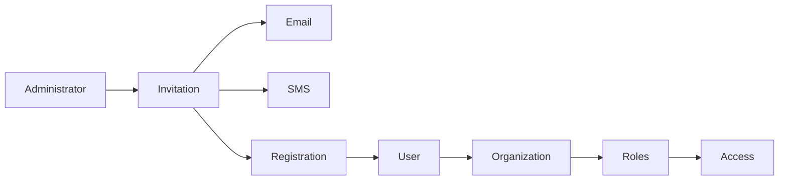

# Invitations

---

# Overview

The Invitations component manages secure onboarding into the Capanna Digital Platform (CDP).

Instead of manually creating identities, administrators invite users through controlled invitation workflows.

Each invitation contains security policies, expiration rules, organization assignments, role assignments, tenant restrictions, and onboarding requirements.

The invitation process ensures every new identity enters the platform using approved governance and compliance policies.

---

# Objectives

The Invitations component provides:

- Secure onboarding
- Self-service registration
- Organization invitations
- Team invitations
- Partner onboarding
- Supplier onboarding
- Customer onboarding
- Temporary invitations
- Multi-tenant invitations
- External collaboration

---

# Responsibilities

The module manages:

- Invitation creation
- Invitation approval
- Invitation acceptance
- Invitation expiration
- Invitation revocation
- Invitation auditing
- Role assignment
- Organization assignment
- Team assignment
- License allocation
- MFA enforcement

---

# Architecture



---

# Invitation Types

## Employee Invitation

For internal staff.

---

## Customer Invitation

For customer portal access.

---

## Supplier Invitation

For suppliers and vendors.

---

## Partner Invitation

For business partners.

---

## Contractor Invitation

Temporary workforce.

---

## Guest Invitation

Limited system access.

---

## API Client Invitation

Machine identities.

---

## AI Agent Invitation

AI services and autonomous agents.

---

# Invitation Lifecycle

Draft

↓

Pending

↓

Sent

↓

Delivered

↓

Accepted

↓

Activated

↓

Expired

↓

Revoked

---

# Invitation Policies

Each invitation defines:

- Organization
- Tenant
- Roles
- Groups
- User Type
- License
- MFA Requirement
- Expiration Date
- Maximum Uses
- Allowed Domains

---

# Registration Flow

Administrator

↓

Create Invitation

↓

Email Sent

↓

Verification

↓

Password Creation

↓

MFA Enrollment

↓

Profile Completion

↓

Policy Acceptance

↓

Account Activation

---

# Database

## invitations

| Field | Type |
|--------|------|
| id | UUID |
| token | varchar |
| email | varchar |
| organization_id | UUID |
| tenant_id | UUID |
| role_id | UUID |
| invitation_type | varchar |
| expires_at | timestamp |
| accepted_at | timestamp |
| created_by | UUID |

---

# APIs

## Create Invitation

POST

```
/identity/invitations
```

---

## Get Invitation

GET

```
/identity/invitations/{id}
```

---

## Accept Invitation

POST

```
/identity/invitations/{token}/accept
```

---

## Revoke Invitation

POST

```
/identity/invitations/{id}/revoke
```

---

## Resend Invitation

POST

```
/identity/invitations/{id}/resend
```

---

# Events

```
invitation.created

invitation.sent

invitation.delivered

invitation.accepted

invitation.expired

invitation.revoked

user.onboarded
```

---

# Security

Rules

- One-time invitation tokens
- Cryptographically secure tokens
- Automatic expiration
- Email verification required
- MFA enrollment before activation
- Audit every action
- Prevent invitation replay
- IP reputation validation

---

# Compliance

Supports

- ISO 27001
- SOC 2
- GDPR
- HIPAA
- NIST
- Zero Trust

---

# Performance Targets

| Operation | Target |
|-----------|---------|
| Create Invitation | <100 ms |
| Accept Invitation | <300 ms |
| Send Email | <2 sec |

---

# Best Practices

- Never expose invitation tokens.
- Use short expiration periods.
- Require MFA enrollment.
- Limit invitations by organization.
- Automatically revoke unused invitations.
- Audit every onboarding event.

---

# Future Enhancements

- QR Code invitations
- Passwordless onboarding
- Mobile onboarding
- AI-assisted onboarding
- Identity verification integrations
- Government ID verification
- Biometric enrollment

---

# Related Documents

- USERS.md
- ORGANIZATIONS.md
- TENANTS.md
- ROLES.md
- USER_TYPES.md
- PROFILE.md
- MFA.md
- AUTHENTICATION.md
