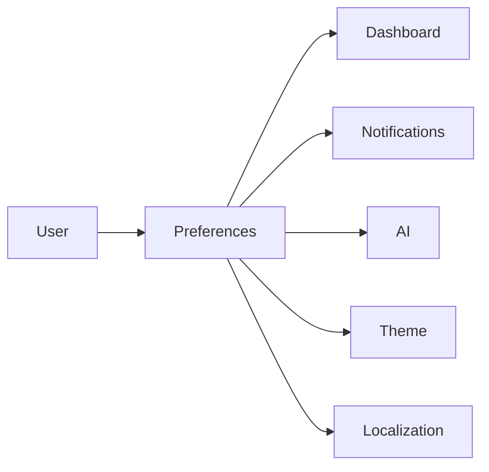

# Preferences

---

# Overview

The Preferences component manages personal configuration settings for every identity within the Capanna Digital Platform (CDP).

Preferences allow users to personalize their workspace while maintaining enterprise governance and security standards.

Unlike Profile information, Preferences affect how the platform behaves rather than who the user is.

---

# Objectives

The Preferences component provides:

- User personalization
- Theme management
- Dashboard customization
- Notification preferences
- Language settings
- Accessibility settings
- AI personalization
- Regional configuration
- Device preferences
- Productivity improvements

---

# Responsibilities

The Preferences module manages:

- UI themes
- Dashboard layouts
- Favorite modules
- Language
- Timezone
- Date format
- Number format
- Currency display
- Notifications
- Email preferences
- Mobile preferences
- AI assistant settings
- Accessibility options
- Startup page

---

# Architecture



---

# Preference Categories

## Appearance

- Light Theme
- Dark Theme
- System Theme
- Accent Color
- Font Size
- Density

---

## Dashboard

- Default Dashboard
- Widgets
- Favorites
- Recent Items
- Quick Actions
- Sidebar State

---

## Localization

- Language
- Timezone
- Currency
- Date Format
- Time Format
- Number Format

---

## Notifications

- Email
- SMS
- Push Notifications
- In-App Notifications
- Manufacturing Alerts
- ERP Alerts
- AI Notifications

---

## AI Preferences

- Preferred AI Model
- AI Suggestions
- Auto Completion
- Smart Recommendations
- AI Language
- AI Memory Settings

---

## Accessibility

- High Contrast
- Screen Reader
- Keyboard Navigation
- Large Text
- Motion Reduction

---

## Manufacturing

- Default Plant
- Default Warehouse
- Default Production Line
- Default Machine
- Barcode Scanner Settings

---

# Database

## preferences

| Field | Type |
|--------|------|
| id | UUID |
| user_id | UUID |
| theme | varchar |
| language | varchar |
| timezone | varchar |
| dashboard | json |
| notifications | json |
| ai_settings | json |
| accessibility | json |
| created_at | timestamp |

---

# APIs

## Get Preferences

GET

```
/identity/preferences
```

---

## Update Preferences

PUT

```
/identity/preferences
```

---

## Reset Preferences

POST

```
/identity/preferences/reset
```

---

# Events

```
preferences.created

preferences.updated

preferences.reset

theme.changed

language.changed

dashboard.updated
```

---

# Security

Rules

- Users manage only their own preferences.
- Administrators may enforce enterprise defaults.
- Sensitive security preferences require re-authentication.
- Preference changes are audited.

---

# Enterprise Defaults

Examples

- Default Language
- Corporate Theme
- Manufacturing Dashboard
- ERP Home Page
- Required Notifications
- Default AI Model

---

# Performance Targets

| Operation | Target |
|-----------|---------|
| Load Preferences | <50 ms |
| Save Preferences | <100 ms |

---

# Best Practices

- Keep enterprise defaults centralized.
- Store preferences separately from Profile.
- Support cross-device synchronization.
- Version preference schemas.
- Allow user overrides where permitted.

---

# Future Enhancements

- AI-generated dashboard layouts
- Personalized workflow recommendations
- Device-specific preferences
- Cross-platform synchronization
- Context-aware preferences

---

# Related Documents

- PROFILE.md
- USERS.md
- ORGANIZATIONS.md
- AI/README.md
- UI-UX/README.md
