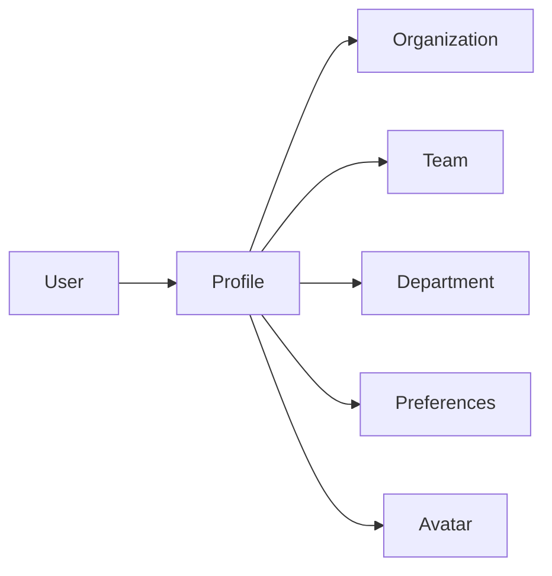
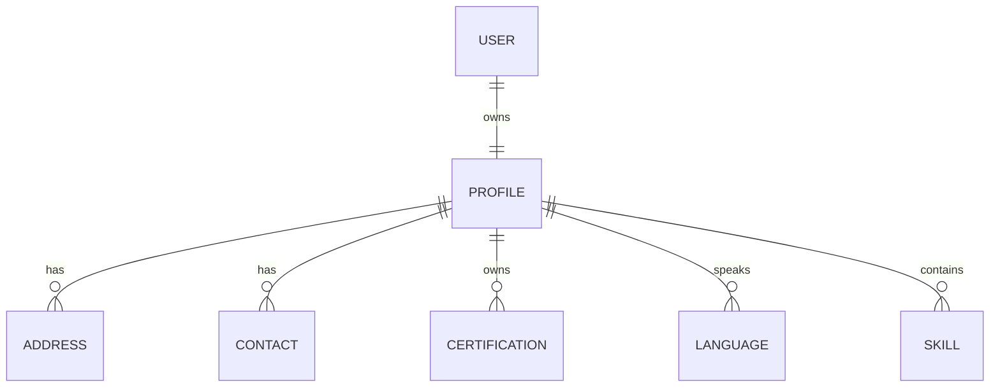

# Profile

---

# Overview

The Profile component stores the complete digital identity of every user within the Capanna Digital Platform (CDP).

While the User record identifies an identity, the Profile contains the personal, professional, organizational, and application-specific information required by every business module.

The Profile serves as the single source of truth for user information across ERP, CRM, Manufacturing, HR, Finance, AI, and all integrated services.

---

# Objectives

The Profile component provides:

- Centralized user information
- Employee profile management
- Contact information
- Employment information
- Organization assignment
- Personal preferences
- Profile customization
- Avatar management
- Localization
- Cross-module identity consistency

---

# Responsibilities

The Profile module manages:

- Personal information
- Contact details
- Address information
- Employment details
- Department
- Manager
- Skills
- Languages
- Certifications
- Emergency contacts
- Profile photos
- Signatures
- Timezone
- Regional settings
- Notification preferences

---

# Architecture



---

# Entity Relationship



---

# Profile Sections

## Personal Information

- First Name
- Middle Name
- Last Name
- Display Name
- Preferred Name
- Date of Birth
- Gender
- Nationality

---

## Contact Information

- Email
- Mobile
- Phone
- Emergency Contact

---

## Employment

- Employee ID
- Job Title
- Department
- Team
- Manager
- Employment Type
- Hire Date
- Status

---

## Organization

- Tenant
- Organization
- Business Unit
- Plant
- Warehouse
- Cost Center

---

## Localization

- Language
- Timezone
- Currency
- Date Format
- Number Format

---

## Preferences

- Theme
- Dashboard Layout
- Notification Settings
- AI Assistant Preferences
- Accessibility

---

## Skills

Examples

- CNC Programming
- Cabinet Vision
- ERP Administration
- AI Engineering
- Sales
- Finance
- Purchasing

---

## Certifications

Examples

- PMP
- ISO 9001
- OSHA
- Microsoft
- AWS
- Cisco

---

# Database

## profiles

| Field | Type |
|--------|------|
| id | UUID |
| user_id | UUID |
| employee_number | varchar |
| first_name | varchar |
| last_name | varchar |
| display_name | varchar |
| birth_date | date |
| gender | varchar |
| nationality | varchar |
| timezone | varchar |
| language | varchar |
| avatar | varchar |
| created_at | timestamp |

---

# APIs

## Get Profile

GET

```
/identity/profile/{userId}
```

---

## Update Profile

PUT

```
/identity/profile/{userId}
```

---

## Upload Avatar

POST

```
/identity/profile/avatar
```

---

## Update Preferences

PUT

```
/identity/profile/preferences
```

---

# Events

```
profile.created

profile.updated

profile.deleted

profile.avatar.updated

profile.preference.updated
```

---

# Security

Rules

- Users may edit their own profile.
- HR Administrators may edit employment information.
- Managers may edit reporting relationships.
- Sensitive fields require elevated permissions.
- Every modification is audited.

---

# Performance Targets

| Operation | Target |
|-----------|---------|
| Load Profile | <100 ms |
| Update Profile | <150 ms |
| Upload Avatar | <300 ms |

---

# Best Practices

- Keep profile information synchronized.
- Avoid duplicate user information.
- Store only business-required attributes.
- Use localization settings for all user interfaces.
- Audit every profile modification.

---

# Future Enhancements

- Digital business cards
- AI-generated profile summaries
- Skills recommendations
- Competency matrix
- Learning history
- Career development tracking

---

# Related Documents

- USERS.md
- ORGANIZATIONS.md
- TEAMS.md
- USER_TYPES.md
- PREFERENCES.md
