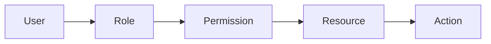
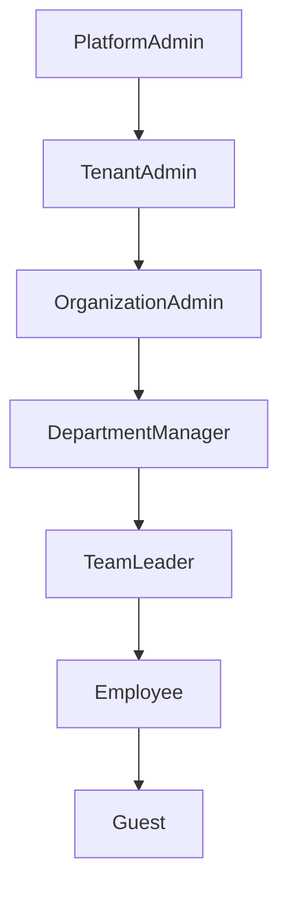
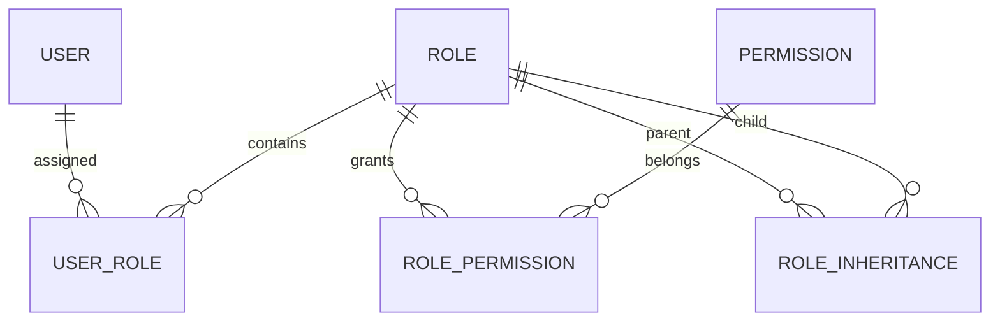

# Roles

---

# Overview

The Role component defines the authorization model of the Capanna Digital Platform (CDP).

A Role represents a collection of permissions that may be assigned to users, service accounts, API clients, AI agents, or external identities.

Roles simplify permission management by grouping related privileges into reusable business responsibilities.

Every access decision inside CDP is ultimately evaluated against one or more assigned roles.

---

# Objectives

The Roles component provides:

- Centralized authorization
- Role-Based Access Control (RBAC)
- Enterprise security governance
- Permission inheritance
- Multi-tenant isolation
- Separation of duties
- Compliance support
- Least-privilege enforcement
- Delegated administration
- Auditability

---

# Responsibilities

The module is responsible for:

- Creating roles
- Updating roles
- Deleting roles
- Assigning permissions
- Removing permissions
- Role inheritance
- Role templates
- Default roles
- System roles
- Tenant roles
- Organization roles
- Department roles
- Temporary roles
- Emergency roles

---

# Architecture



---

# Role Hierarchy



---

# Entity Relationships



---

# Core Concepts

## System Roles

Created by the platform.

Cannot be deleted.

Examples

- Platform Administrator
- System Auditor
- Security Officer

---

## Tenant Roles

Scoped to a tenant.

Examples

- Tenant Admin
- Finance Manager
- Manufacturing Director

---

## Organization Roles

Scoped to an organization.

Examples

- HR Manager
- Sales Manager
- Purchasing Manager

---

## Team Roles

Scoped to teams.

Examples

- Team Leader
- Operator
- Supervisor

---

# Permission Model

Permissions follow this syntax

```
resource.action
```

Examples

```
users.create
users.read
users.update
users.delete

roles.assign
roles.remove

inventory.receive

inventory.issue

orders.create

orders.approve

finance.pay

manufacturing.start_job

manufacturing.finish_job

reports.export

ai.train

ai.deploy
```

---

# Permission Categories

## Identity

- users.*
- roles.*
- groups.*
- organizations.*

## Manufacturing

- production.*
- machines.*
- maintenance.*

## ERP

- inventory.*
- purchasing.*
- warehouse.*

## CRM

- customers.*
- quotations.*
- orders.*

## Finance

- invoices.*
- accounting.*
- payments.*

## HR

- employees.*
- payroll.*
- attendance.*

## AI

- models.*
- prompts.*
- agents.*

---

# Database Model

## roles

| Field | Type |
|--------|------|
| id | UUID |
| tenant_id | UUID |
| organization_id | UUID |
| name | varchar |
| code | varchar |
| description | text |
| system_role | boolean |
| active | boolean |
| created_at | timestamp |
| updated_at | timestamp |

---

## role_permissions

| Field | Type |
|--------|------|
| role_id | UUID |
| permission_id | UUID |

---

## user_roles

| Field | Type |
|--------|------|
| user_id | UUID |
| role_id | UUID |
| assigned_by | UUID |
| assigned_at | timestamp |
| expires_at | timestamp |

---

# API

## Create Role

POST

```
/identity/roles
```

---

## Update Role

PUT

```
/identity/roles/{id}
```

---

## Delete Role

DELETE

```
/identity/roles/{id}
```

---

## Assign Role

POST

```
/identity/users/{id}/roles
```

---

## Remove Role

DELETE

```
/identity/users/{id}/roles/{roleId}
```

---

# Events

```
role.created

role.updated

role.deleted

role.assigned

role.unassigned

permission.granted

permission.revoked
```

---

# Security Rules

A role may only assign permissions that it already possesses.

Platform roles cannot be modified by tenant administrators.

Tenant administrators cannot access other tenants.

Inactive roles cannot be assigned.

Expired assignments are ignored automatically.

Every role assignment is audited.

---

# Audit Log

Every operation records:

- Timestamp
- User
- Tenant
- Organization
- Previous Value
- New Value
- IP Address
- Device
- Session
- Correlation ID

---

# Performance

Target response times

| Operation | Target |
|-----------|---------|
| Get Roles | <100 ms |
| Assign Role | <150 ms |
| Permission Check | <5 ms |

---

# Best Practices

- Prefer least privilege
- Avoid direct user permissions
- Use role inheritance carefully
- Separate duties for finance approval
- Use temporary roles for contractors
- Audit all assignments
- Review roles periodically
- Remove unused roles

---

# Future Enhancements

- Attribute-Based Access Control (ABAC)
- Policy-Based Access Control (PBAC)
- Context-aware permissions
- AI-generated role recommendations
- Dynamic permissions
- Risk-based authorization
- Zero Trust integration

---

# Related Documents

- USERS.md
- GROUPS.md
- PERMISSIONS.md
- SECURITY/RBAC.md
- AUTHORIZATION.md
