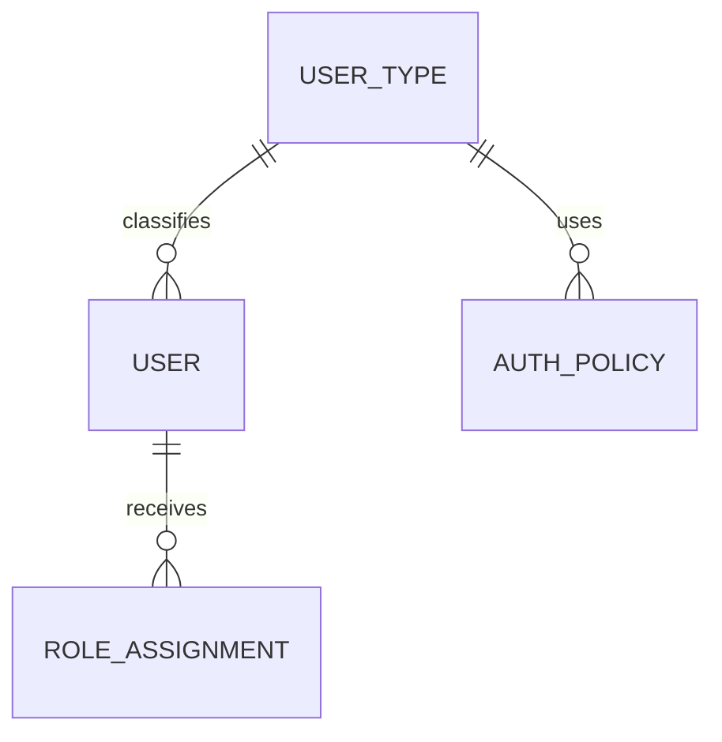

# User Types

---

# Overview

The User Types component defines the classification of identities within the Capanna Digital Platform (CDP).

While Roles determine **what a user can do**, User Types define **what a user is**.

Every identity in the platform belongs to exactly one primary User Type, which influences lifecycle management, authentication policies, security controls, licensing, provisioning workflows, and compliance requirements.

---

# Objectives

The User Types component provides:

- Identity classification
- Authentication policy assignment
- Lifecycle management
- Provisioning automation
- Security policy enforcement
- Licensing control
- Compliance mapping
- API identity management
- AI identity support

---

# Core Principle

```
Identity Type
↓

Authentication Policy
↓

Lifecycle Rules
↓

Roles

↓

Permissions
```

---

# Standard User Types

## Employee

Internal workforce.

Examples:

- HR
- Finance
- Sales
- Manufacturing
- Warehouse
- Procurement
- IT

---

## Contractor

Temporary workers.

Examples

- Consultants

- External Developers

- Installation Teams

- Maintenance Companies

---

## Customer

External platform users.

Examples

- Retail Customer

- Distributor

- Dealer

- Enterprise Client

---

## Supplier

Business partners.

Examples

- MDF Supplier

- Hardware Vendor

- Logistics Company

---

## Partner

Strategic organizations.

Examples

- Franchise

- Government

- Technology Partner

- University

---

## Service Account

Non-human identity.

Examples

- ERP Integration

- Manufacturing API

- CRM Synchronization

- Backup Service

---

## API Client

Programmatic access.

Examples

- Mobile App

- Web Portal

- AI API

- Third-party Integration

---

## AI Agent

Artificial Intelligence identities.

Examples

- Manufacturing Planner

- AI Sales Assistant

- Customer Support AI

- Document Analyzer

---

## Robot / Device

Machine identities.

Examples

- CNC Machine

- PLC

- Barcode Scanner

- IoT Gateway

---

## External Identity

Federated users.

Examples

- Azure AD

- Google Workspace

- Okta

- Keycloak

---

# Entity Relationship



---

# Database

## user_types

| Field | Type |
|--------|------|
| id | UUID |
| code | varchar |
| name | varchar |
| description | text |
| authentication_policy | varchar |
| default_role | UUID |
| active | boolean |

---

# Lifecycle

```
Provision

↓

Activate

↓

Authenticate

↓

Operate

↓

Suspend

↓

Deactivate

↓

Archive
```

---

# Authentication Policies

| Type | MFA | Password | SSO |
|------|-----|----------|-----|
| Employee | Required | Yes | Yes |
| Contractor | Required | Yes | Yes |
| Customer | Optional | Yes | Optional |
| Supplier | Optional | Yes | Optional |
| Service Account | No | Secret | No |
| API Client | No | Token | No |
| AI Agent | No | Certificate | No |
| Robot | No | Certificate | No |

---

# APIs

## List User Types

GET

```
/identity/user-types
```

---

## Get User Type

GET

```
/identity/user-types/{id}
```

---

## Create User Type

POST

```
/identity/user-types
```

---

## Update User Type

PUT

```
/identity/user-types/{id}
```

---

# Events

```
user_type.created

user_type.updated

user_type.deleted

user.type.changed
```

---

# Security Rules

- Every identity must belong to one User Type.
- User Type changes require auditing.
- Authentication policies are inherited from User Type.
- Roles never replace User Types.
- AI identities cannot authenticate as Employees.

---

# Best Practices

- Keep User Types limited.
- Use Roles for authorization.
- Use Groups for administration.
- Use Organizations for ownership.
- Use User Types for lifecycle management.

---

# Future Enhancements

- Dynamic User Types
- Risk-based User Types
- AI-generated classifications
- Behavioral User Types
- Temporary User Types

---

# Related Documents

- USERS.md
- ROLES.md
- GROUPS.md
- AUTHENTICATION.md
- SECURITY/MFA.md
